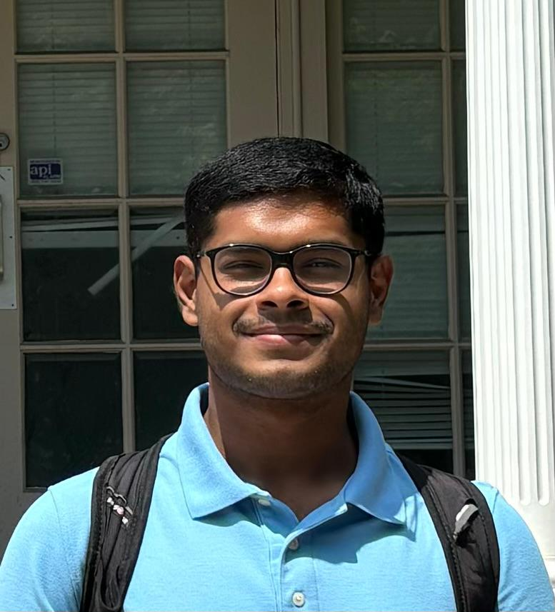

    

        
        

            I'm Anish Banerjee, a final year undergraduate in Computer Science and Engineering at the Indian Institute of Technology, Delhi.  
            You can navigate the webpage by clicking on the sidebar (top left corner). 
            I've done some expository writing, which you can find out about in the <a href="notes">Expository Writing</a> section. 
            Find my CV <a href = "./Anish_CV.pdf">here</a>.
        

    

    

        
        

            I'm Anish Banerjee, a final year undergraduate in Computer Science and Engineering at the Indian Institute of Technology, Delhi.  
            You can navigate the webpage by clicking on the sidebar (top left corner). 
            I've done some expository writing, which you can find out about in the <a href="notes">Expository Writing</a> section. 
            Find my CV <a href = "./Anish_CV.pdf">here</a>.
        

    

You can contact me at <code>firstnamelastname2002@gmail.com</code>.
   
A big thanks to <a href="https://arponbasu.github.io/">Arpon Basu</a> for lending his website template!
 <!-- Also, thanks to <a href = "https://shankhgupta.github.io/">Shankh Gupta</a> for designing the favicon! -->
  